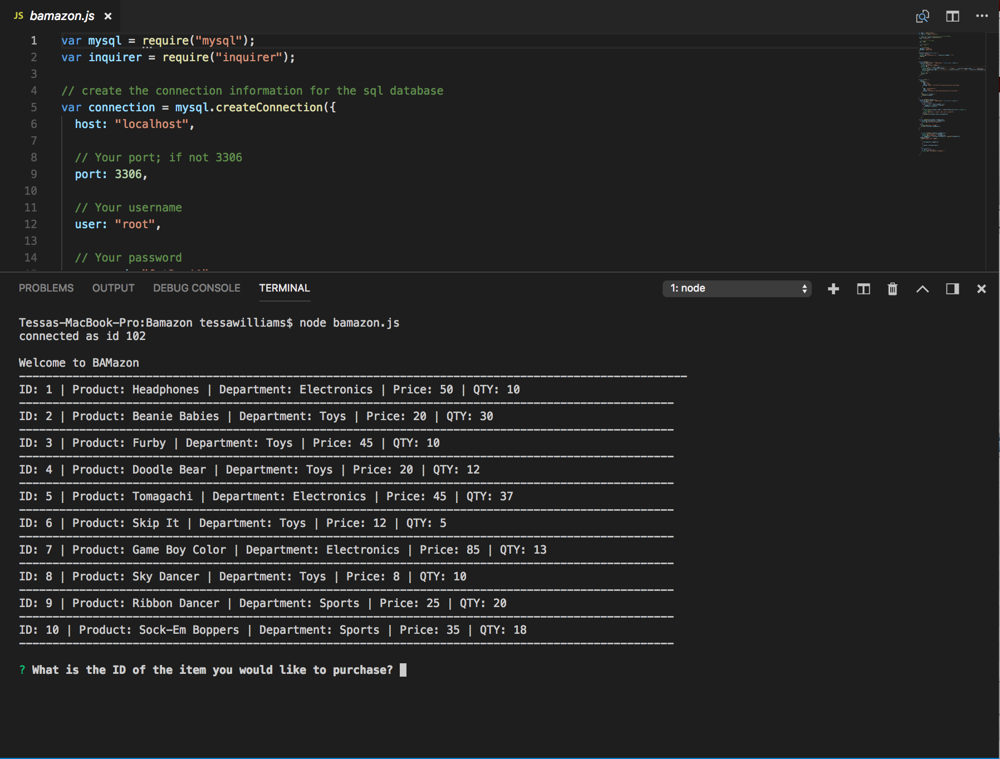
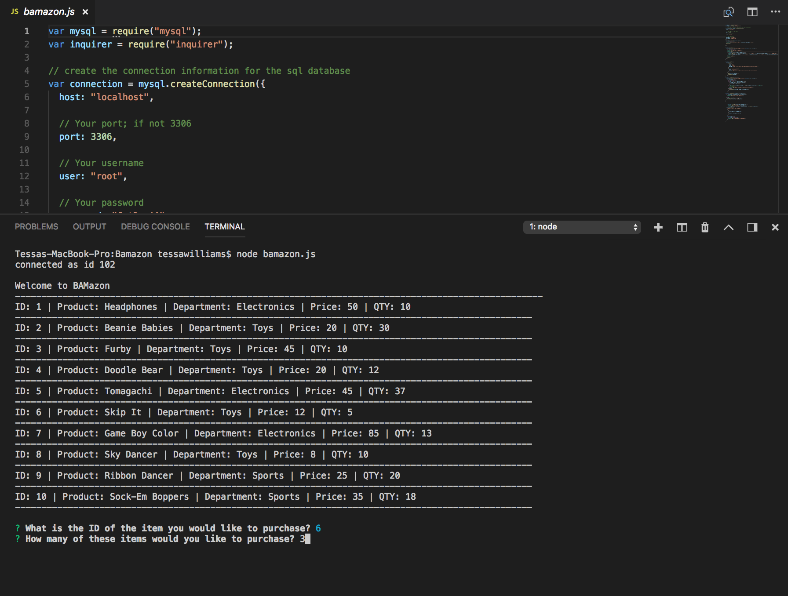
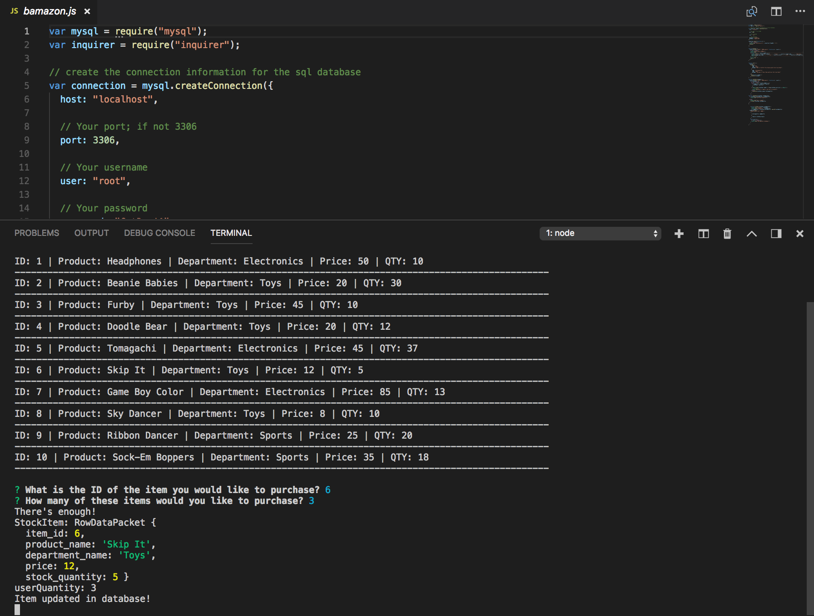
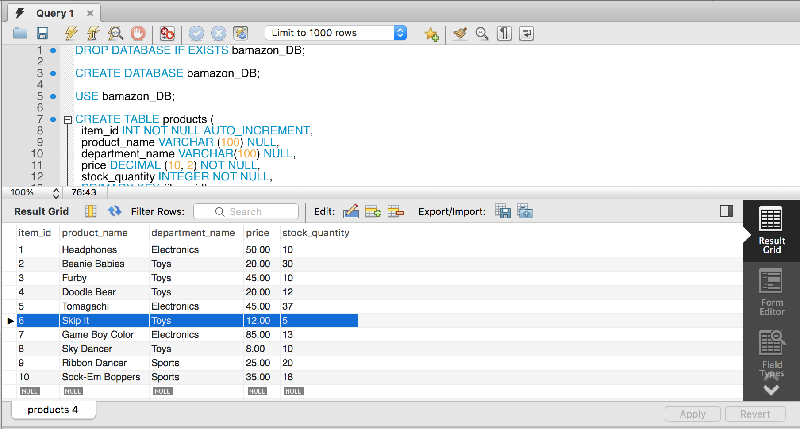
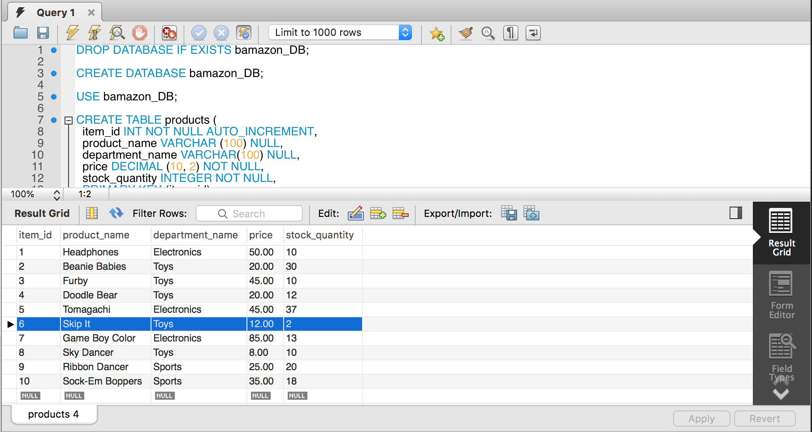
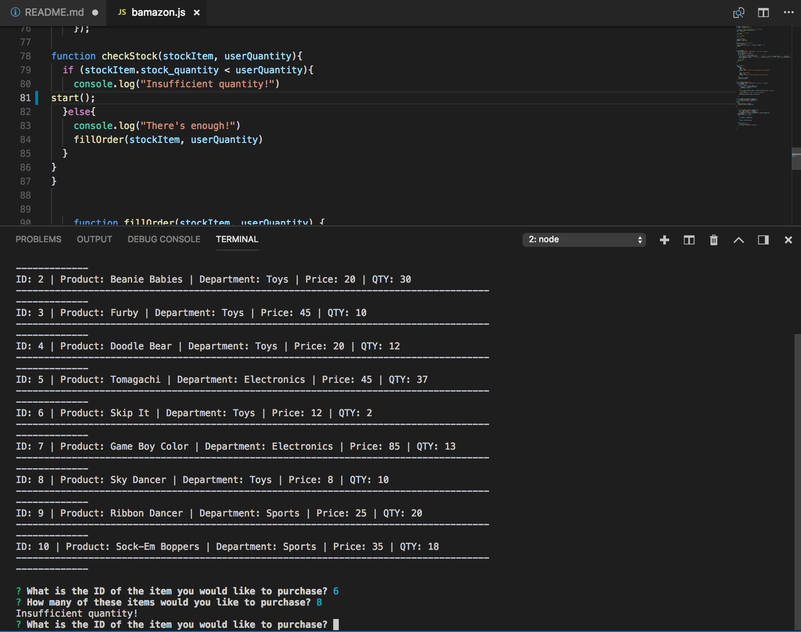

# Bamazon

Run a 'node bamazon.js' in terminal in order to initialize the Bamazon store. 

This will display a list of all of the items in stock that you may peruse as well as an inquire prompt asking for the ID and then the quantity of the item that you would like to purchse. 

Once that information has been put in, Bamazon will check that there is enough of the item in stock to fill that order. 

If enough of the item exists in the database, Bamazon will update the table in mySQl to reflect that the requested quantity of that item has been removed. 

If there is not enough of the item to fulfill the order, Banazon will alert the user that there is an insufficient quantity and display another prompt for them to put in another item ID.

https://t-williams13.github.io/Bamazon---T.W./
